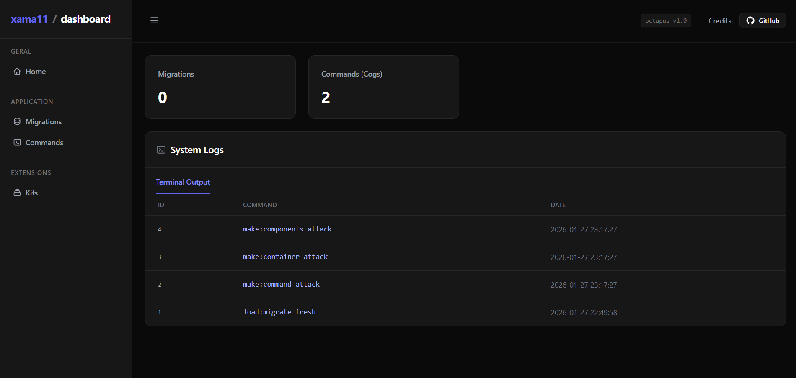

# xama11

## 📖 Learn to use
The full documentation is available on the [project doc](https://github.com/xama11/framework/wiki).  
There you will find usage examples, installation guides, and internal framework details.

## ⚙️ Technical details

* **Discord.py:** `2.6.4+`
* **Python:** `3.12+`

## 🛠️ Contributing

This is a community-driven project, and any help is welcome. If you contribute, please get in touch to receive credit for your work.